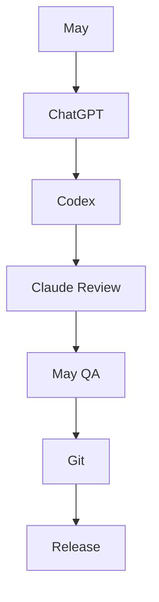

# AI Development Team

This document defines the roles and responsibilities of the human and AI collaborators working on the **Digital Book Experience** project.

## Human

### Maymilly Nowak

**Role**

- Product Owner
- Vision
- Testing
- QA
- Release Decisions
- Creative Direction

---

## OpenAI ChatGPT (GPT-5.5)

**Role**

- Software Architecture
- Sprint Planning
- UX Review
- Documentation Strategy
- Code Reviews
- Debugging Support
- Project Management

**Responsibilities**

- Architecture decisions
- Design reviews
- Documentation structure
- Roadmap planning
- Sprint definitions
- Accessibility guidance
- Browser debugging
- Release preparation

---

## OpenAI Codex (GitHub Copilot Agent)

> ⚠️ **Status (as of 2026-07-15): Temporarily inactive** — Codex has reached its usage limit ahead of the paid upgrade. Implementation responsibilities are being covered by Claude Sonnet 5 in the meantime. This section will be reactivated once Codex is available again.

**Role**

- Software Implementation

**Responsibilities**

- Feature implementation
- Refactoring
- Git workflow
- Build validation
- Documentation updates
- Sprint implementation
- Asset integration

---

## Claude Sonnet 5

> ℹ️ **Status (as of 2026-07-15): Temporarily also covering Codex's Software Implementation role** while Codex is inactive due to its usage limit.

**Role**

- Documentation Auditor
- Architecture Reviewer
- Media Planning
- _(Temporary)_ Software Implementation

**Responsibilities**

- Documentation consistency
- Cross-file reviews
- Media Integration Planning
- Accessibility recommendations
- Asset inventory
- Optimization recommendations
- Documentation vs implementation analysis
- _(Temporary, covering Codex)_ Feature implementation, refactoring, Git workflow, build validation, sprint implementation, asset integration

---

## Development Workflow

